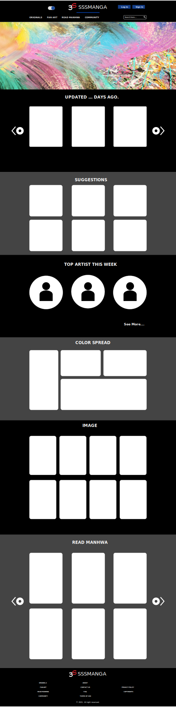

Manga Reader

## Date: 12/16/2021

### By: **Mohamed Kone**

#### [GitHub](https://Github.com/Mohamedkone)|[Website](https://www.Mohamedkone.com)

---

### **_Description_**

#### 3s collection is a website where you can find a collection of manga and manhwa to read on your down times. At the same time users can upload their or see other users fan arts

---

### **_Technology Used_**

- React
- MongoDB
  - Mongo
- Node
- Adobe XD
- Insomnia
- Express
- Git

### **_Getting Started_**

##### Some functionnalities are still in the working (Search, Sign up/in, community page, light/dark Mode). For copyright issues only one real chapter is available on the website which is a one piece chapter.

##### A Trello board was used to keep track of development progress and can be viewed [here](URL).

---

### **_Screenshots_**

##### Wireframe

##### Final

### **_Future updates_**

- [ ] Log in/ Log out function
- [ ] Community Page
- [ ] Fan_art page Page change
- [ ] Populate Manwha collection
- [ ] Create Manga page with descriptions

---

### **_Credits_**
- Any Fan art on the website were made by Mohamed Kone
- Any manga images and chapter available on the website are copyrighted by
SHUEISHA and Shogakukan